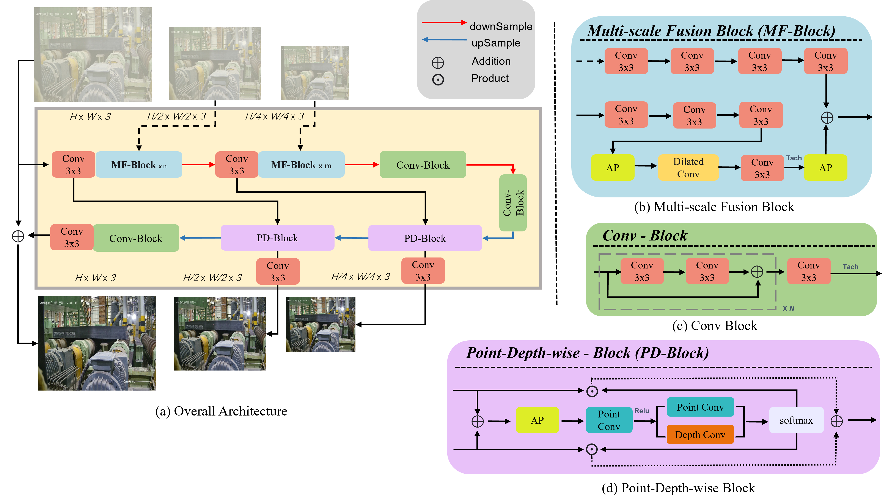
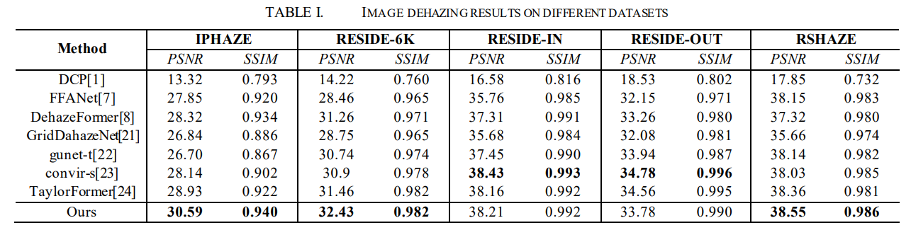

<<<<<<< HEAD
# MFDehaz-Net
=======
# An Easily Deployable Image Dehazing Model for Industrial Sites

> **Abstract:** 
Visual information processing is an important part of industrial intelligence. In industrial settings, eliminating camera lens fog-induced blur poses a formidable challenge. Traditional dehazing methods based on imaging principles are difficult to meet the needs of industrial scenes. In recent years, methods based on complex deep networks, such as transformer, have shown better dehazing performance. However, their practicability is restricted by low adaptability to industrial scenarios. It is necessary to realize an effective and lightweight model that can be applied in industrial site. 
For such a purpose, an effective image dehazing model named MFDehaz-Net is proposed. MFDehaz-Net has two specially designed components, i.e., Multi-scale Fusion Block and Point-Depth wise Block, which help it achieve deep fusion of image features of different scales to obtain better global understanding. Besides, to reduce the damage to the original color of the image caused by image dehazing, MFDehaz-Net integrates the supervision signal in the frequency domain with a specially designed loss function. Experimental results demonstrate that MFDehaz-Net outperforms SOTA models in dehazing, especially in terms of color preservation and anti-interference, with much shorter inference time.

### Network Architecture

### Main Results

### Some information

- **2024/09/11** Code will be released in the near future.The dataset proposed in this paper will not be publicly available for policy reasons, so you can contact us if necessary.

>>>>>>> 14ff6bc (first commit)
